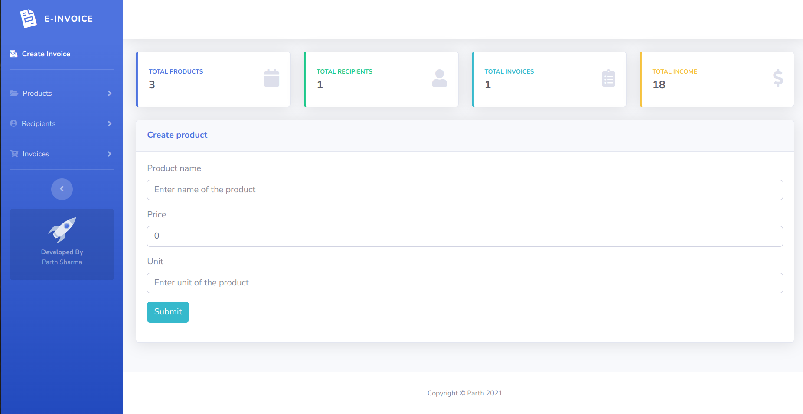
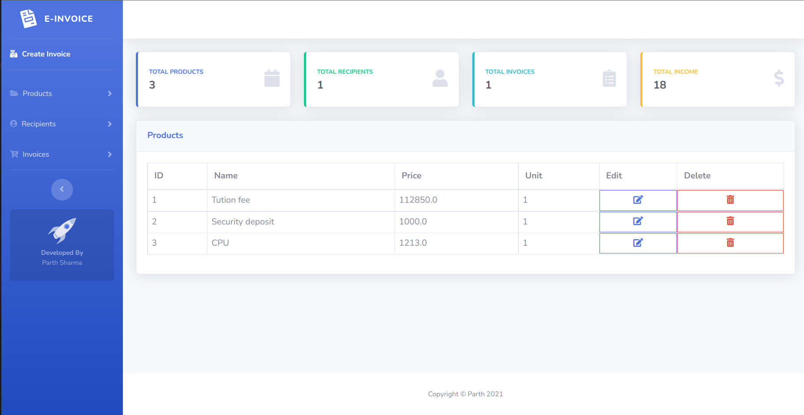
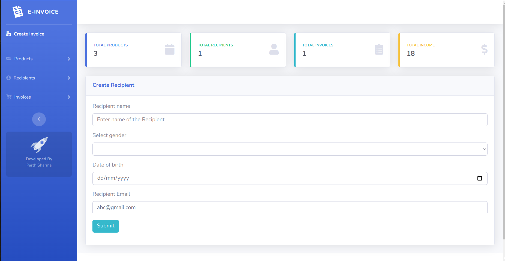
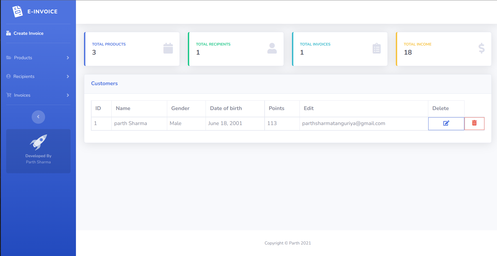
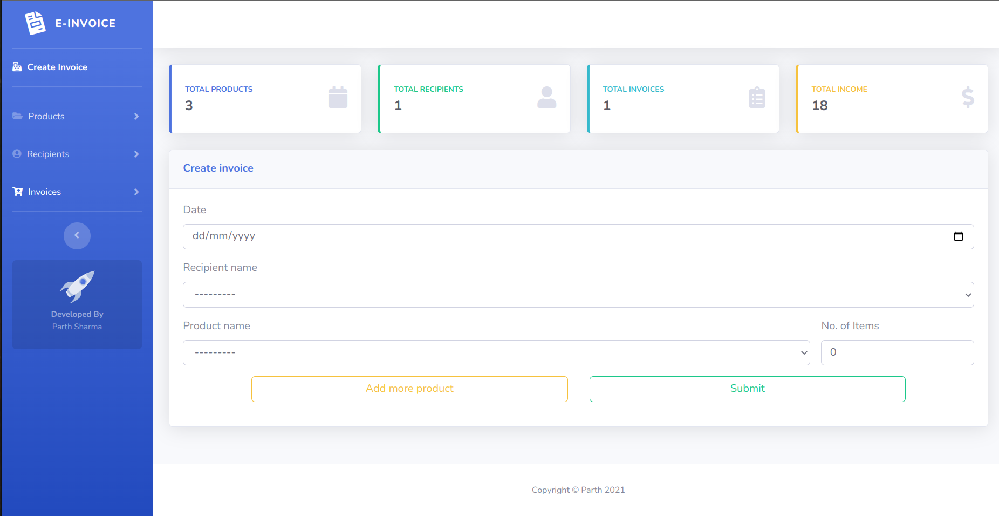
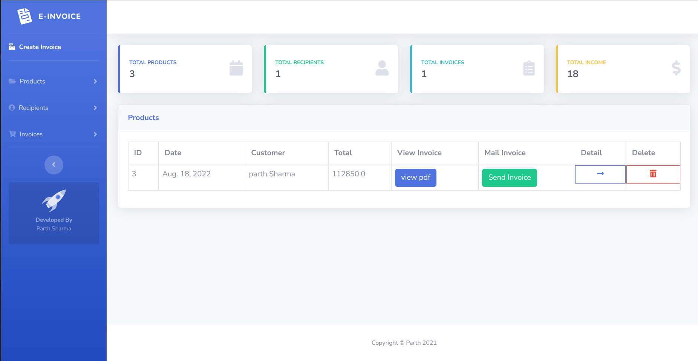

# Invoice Management system

## Problem Statement:

There is a problem in the college that the students have to make a queue at the accounts office window. This application is an offline application to make invoice and send it to emails in just one click.

## Features

1. Single user Application (Multi-user will be available soon).
2. User can enter details about different products or facilities and their charges.
3. User can create and edit the details of the invoice.
4. User can view, download and send invoice in PDF format to mentioned recipient.
5. User can add and edit recipients at any time.

## Technology Stack:

    

- **Frontend**: Bootstrap SBAdmin Template
- **Backend**: Django
- **IDE**: VS Code
- **Version Control**: Git and GitHub
- **Database**: SQLite
- **Hosting**: Heroku(not deployed)

### Getting Started

### Fork, clone locally & create a branch

Fork [Invoice System](https://github.com/ParthSharmaT/Invoice_system) repository and clone at your local

- Fork and Clone the repo using

```
$ git clone https://github.com/ParthSharmaT/Invoice_system.git
```

### Setting Environment First Time

#### Basic Requirements

1. [Python](https://www.python.org/downloads/)
1. [pip](https://pip.pypa.io/en/stable/installation/)

#### Creating [Virtual Environment](https://docs.python.org/3/library/venv.html)

A virtual environment is a tool that helps keep dependencies required and the project isolated. If you wish to install a new library and write

```
pip install name_of_library
```

on the terminal without activating an environment, all the packages will be installed globally which is not a good practice if you’re working with different projects on your computer.

If this sounds a bit complicated, don’t worry so much because a virtual environment is just a directory that will contain all the necessary files for our project to run.

**Installing venv (required once)**

**Windows**

```
py -m pip install --user virtualenv
py -m venv env
```

**Linux**

```
python3 -m pip install --user virtualenv
python3 -m venv env
```

You have to start virtual environment everytime you start new terminal -

**Windows**

Using gitbash

```
. env/Scripts/activate
```

Using Powershell

```
. env\Scripts\activate
```

**Linux**

```
source env/bin/activate
```

#### Installing Requirements

**Windows**

```
pip install -r requirements.txt
pip install -r requirements.txt
```

**Linux**

```
pip install -r requirements.txt
pip install -r requirements.txt
```

#### Migrating Database

**Windows**

```
py manage.py migrate
```

**Linux**

```
python3 manage.py migrate
```

#### Create Superuser

**Windows**

```
py manage.py createsupeser
```

**Linux**

```
python3 manage.py createsupeser
```

### Starting Development Server

**Windows**

```
py manage.py runserver
```

**Linux**

```
python3 manage.py runserver
```

### Leaving the virtual environment

```
deactivate
```

### Update requirements file (Critical)

If you have installed new dependency, the pip freeze command lists the third-party packages and versions installed in the environment.

**Windows**

```
pip freeze > requirements.txt
```

**Linux**

```
pip3 freeze > requirements.txt
```

### Update Database

Everytime you change db models, you need to run makemigrations and migrate to update on database.

**Windows**

```
py manage.py makemigrations
py manage.py migrate
```

**Linux**

```
python3 manage.py makemigrations
python3 manage.py migrate
```

## Screenshots

### Create products/Facilities:



### View and Edit Product/Facilities:



### Create Recipient to whom you send invoice:



### View and Edit Recipient:



### Create Invoice :



### View and Edit Invoice:



## Maintainers✨

<table>
  <tbody>
  <tr>
    <td align="center"><a href="https://github.com/ParthSharmaT"><br><sub><b>Parth Sharma </b></sub></a><br><a href="https://github.com/ParthSharmaT/Invoice_system/commits/master?author=ParthSharmaT" title="Code">💻</a></td>

  </tr>
    
  
</tbody></table>

# License :memo:

This project follows the [MIT License](https://choosealicense.com/licenses/mit/).

[](https://github.com/ParthSharmaT/yoga_app_api)
[](https://github.com/ParthSharmaT/yoga_app_api)
[](https://github.com/ParthSharmaT/yoga_app_api)
[](https://github.com/ParthSharmaT/yoga_app_api)
